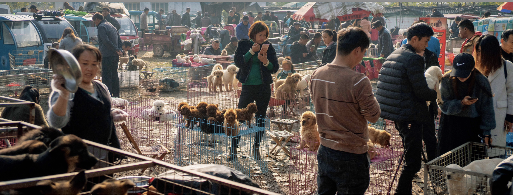

## Preface

**Andy Golding**

At first glance, Jiandong Xu’s unique book on Chinese Dog Markets is an insightful yet neutral, matter-of-fact exposé of places where dogs are traded. As we continue to gaze at his photographs it becomes disturbingly apparent that there is much to reflect on in terms of the images, the animals and the humans who interact with them.

A photograph is not an open window on to the world; the photographer decides what we will see, selects the view point, frames the picture and makes the exposure button at the time which best suits his intention.

When we look at photographs we take up the precise perspective of the photographer, it is as though we are looking at the scene with the single eye of their camera. However whilst we are forced to adopt the objective standpoint of the photographer, the critical observer must concern themselves with the cultural consequences of the image on display and decide if they accept or reject the subjective point of view.

This collection constitutes edited highlights of a project; we can seek the meanings in the order in which they are presented and in their cumulative juxtapositions. In each image we can project ourselves backwards from the frame to make judgements about the motivation of the photographer, and consider the complex relationship between the photographer, the subject and ourselves.

In our various relationships with dogs, these images prompt us to reflect on our values; for here we are presented with a reflection on our culture, which, on the one hand allows for the love of dogs, but on the other hand provides for their exploitation for profit, for blood sport and for food.

The renowned Magnum photographer and prolific photographer of dogs, Elliot Erwitt once said, “Dogs don’t mind being photographed in compromising situations”. This applies to these dog market photographs where we see dogs of every kind in states of resignation, resistance or anticipation of their fate. But dogs have no choice in the matter—they are controlled at every turn by humans.

Erwitt also said, “The whole point of taking pictures is so that you don’t have to explain things with words”—but there is more to these dog market photographs than meets the eye; there is much more to be said...

This book transports us to dog markets where we see them being prepared and displayed, caressed or attacked, chained and caged, bought and sold. Within the fleeting moment of the exposure we subconsciously become detectives, analysing the qualities and emotions of the dogs, and the purpose of the transaction. Crucially Xu faces us with our own and our society’s relationship to these most domesticated of animals.

For those who look at this book, who know the joys the dog as a pet we search for signs of these animals as “man’s best friend”. Dogs, of all the animals, are the creatures who have become most integrated with our lives; they become part of the family, bring joy to children, comfort to the lonely and become as dear to us as friends and relatives. And they appear to love and care for us in return—often displaying warmth in the look in their eyes, their licks of our faces and the wag of their tails. Pet dogs can fill the void when friends, family or partners are lost. We imbue them with human powers of care and comfort and when they themselves are lost or die, our grief knows no bounds.

In these photographs we seek signs of this exchange—in the interrelationship between the photographer, the dogs, their handler and us the viewer.

So we might look for moments where the body language is caring, gentle and comforting, where the photographer has captured a time where the animals catch our eye. We look for faces and expressions which mirror our own, their expressions—appealing, sad, mournful—the mouth that suggests a smile. Here we become conscious that we are looking for human attributes in the dog we might own and befriend, and we seek the emotional response we apply to our children or partners. (A desirable trait well known to dog breeders is to create breeds that look like us, often to the detriment of their health—flattening the faces, increasing eye size—like the Pekingese, the pug and the boxer...)

William Wegman made a successful career as an artist photographer by dressing up his weimaraner dogs as people. Using all the paraphernalia of studio photography, Wegman deployed lighting, staging, costumes and props to create personae for his pets so they look variously like stereotypes of fashion models, society ladies, farmers, detectives, sports fans. Where Erwitt employed the genre of street photography and Henri Cartier-Bresson’s “decisive moment”, Wegman uses the genre of the formal portrait. Looking at these photographs in comparison to the street market photographs, we see that the commonality is in demonstrating that photographers of dogs are revealing as much about themselves as about the canines in their viewfinders.

We project ourselves, our hopes, fears, desires, our love and aggression and our appetites in the fullest sense on to these our closest of creatures.

There is archaeological evidence that dogs have been integrated into Chinese homes for over 7000 years. They were used as guard dogs, hunting dogs and for food. Dogs have entered our homes, our businesses, and penetrate our language. We make them into pets, guide dogs, show dogs, fashion accessories, sleeve dogs, guard dogs, racing dogs, sheep dogs, police dogs, drug sniffer dogs, bomb disposal dogs, fighting dogs.

They are referred to in expressions of the good times—as terms of endearment for our children, and for the bad times. We might be determined and so dogged, falling on hard times so “gone to the dogs”, enjoy “dog days”, be “dog tired”, or be “treated like a dog”...

Jiandong Xu sees all this. Under close scrutiny a thread can be seen running through his photographs which is fundamentally critical of our treatment of dogs and which questions our motives. He has doggedly photographed the contradictions: puppies embraced and cosseted, preened and adored, loved and snapped, whilst others are discarded, (though some rescued) others forced to fight, reared and captured for slaughter, butchered and consumed.

The French born American Elliot Erwitt, focused on the frivolous nature of dogs, the humour and the ironies of their behaviour in and around us on the streets. In human terms we can look back at his work and see this enjoyment is in their actions which echo our own. We can also see, as with so many photographs, the fascinating historical shifts of fashion around the dogs, the shoes, the boots, the skirts and street furniture of the past. Wegman pushes this further by adorning his dogs yet poking fun at them, and in turn their human counterparts and the human fashions he adorns them with. Fundamentally all these photographic projects centre on anthropomorphism—they project onto the animals essentially human actions, emotions and sensibilities.

Jiandong Xu is not interested in the portrait and the candid snap, nor in the frivolity of dog adoration to garner approval. He would be unimpressed by the trivial posting of dog pictures on social media where they now outnumber cats. His work is in the tradition of social documentary—revealing key social concerns at the heart of our society and suggesting a call to action.

His photographs can be read as exotic, to those unfamiliar with dog markets and their environs. In the tradition of intrepid documentary photographers, Xu gives us an insight into a world most of us did not know existed.

For many this will be a revelatory insight into the unseen realm of China, based in the margins of the city and country—far away from the glitz and glamour of the consumerist centres of Shanghai, Guangzhou and Beijing. A wider look day to day people communicating and conversing with each other, their manner of dress, means of transport, market stalls interactions.

The imminent context is China is at time of massive growth of entrepreneurship and world wide significance as a nation, alongside equally rapid shifts in homes, communities, and personal relationships.

This great dog photography project throws light on ourselves. Who we are, what we are becoming, and at a time of myriad threats to our world—how we are to live alongside the creatures of the world and act out our humanity. This is a work with a series of nested messages which asks us to reevaluate our relationship with dogs in particular—animals as a whole, and—on a grander scale—to consider our human relationships and the society in which we are embedded and the human values we hold.

*Andy Golding has a distinguished career in photography. In recognition of his achievements in 2015 he was awarded a Fellowship of the Royal Photographic Society (FRPS)—their highest distinction.*

*He is now the Chairman of the RPS Film panel which confers awards for cinematographers.*

*Other accolades include the 2018 Royal Photographic Society President’s Commendation certificate and the 2009 Fenton Medal.*

*Andy’s academic career includes having been Principal Lecturer and Head of the prestigious Department of Photography and Film at the UK University of Westminster.*

